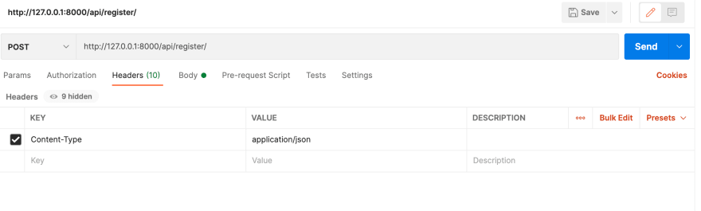
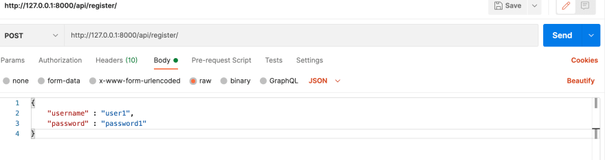
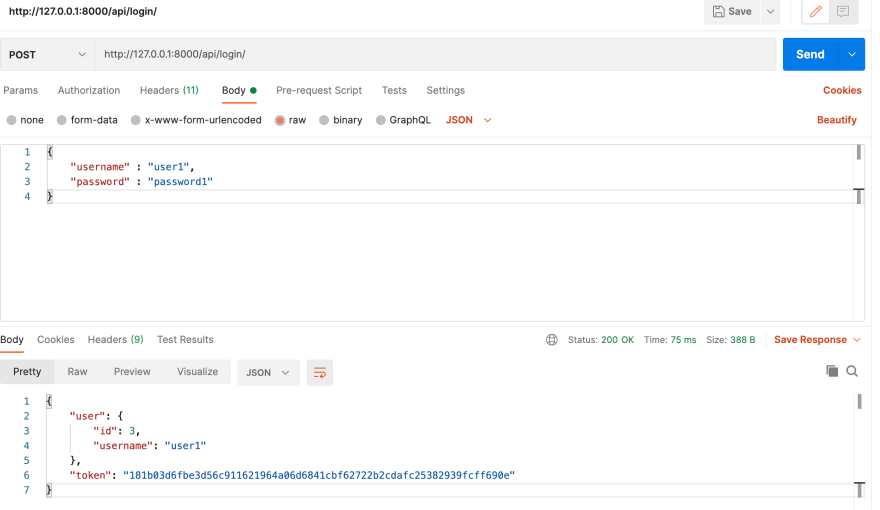
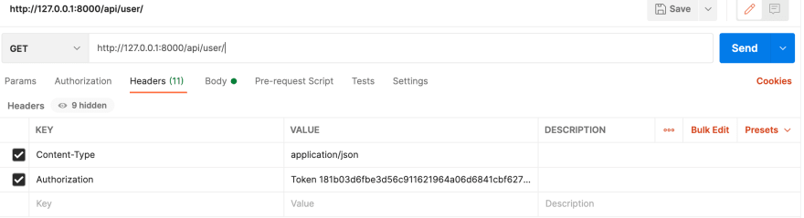

# amiibo_auth
<h4 align="center"> 
	🚧  Em construção... 🚧
</h4>

## Register (using POSTMAN)
>localhost:8000/api/register/  

HEADER: add key <strong>Content-Type</strong> and value <strong>application/json</strong>

<h1 align="center">
  
</h1>

BODY: add <strong>JSON</strong> like this:

<h1 align="center">
  
</h1>

## Login (using POSTMAN)
>localhost:8000/api/login/  

BODY: adding the same body used to register and POST method

<h1 align="center">
  
</h1>

## User (using POSTMAN)
>localhost:8000/api/user/  

To you able to view the user detail, you <strong>need to pass the token</strong> like this:

<h1 align="center">
  
</h1>
